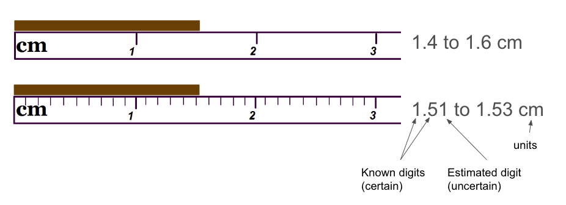
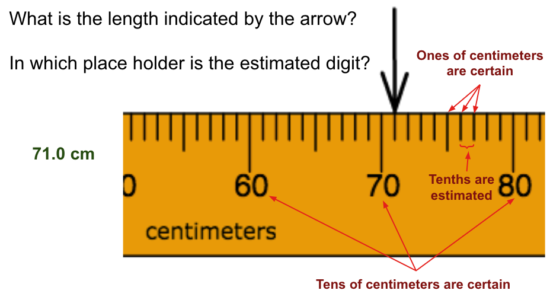
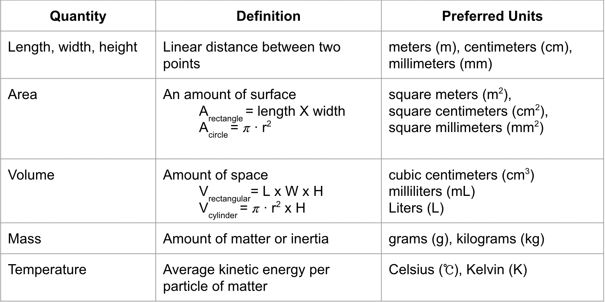

# Scientific Measurement

### A requirement in the practice of science

---
---
Macy Giffin,
Chemistry,
Period 3

If you need to follow along, feel free to go to [Google Slides](https://docs.google.com/presentation/d/10nFf0TFdjhRJ-NAuVGHlCKi29uMEjvmvxi4QQLVtBV8/edit#slide=id.p "Scientific Measurement").

A **proper measurement** has exactly _one_ estimated digit and includes the correct units.

The amount of _uncertainty_ in a measurement depends on which place holder the estimated digit is in.

**Percision**: the amount of uncertainty in a measurement

**Accuracy**: how close a measurement is to the true value.
**Remember**:

- starts at zero
- marks are properly placed
- always use the classes data, not your own

When measuring, **ALWAYS** remember to use the correct units because if you don't it could throw everything off.
