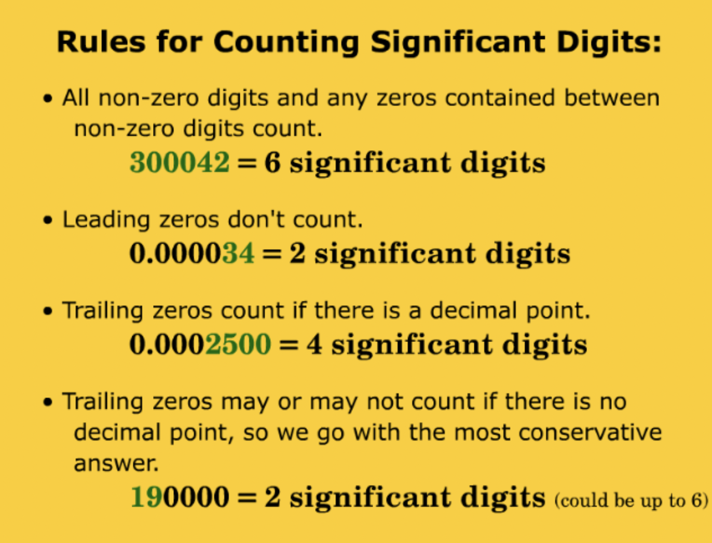
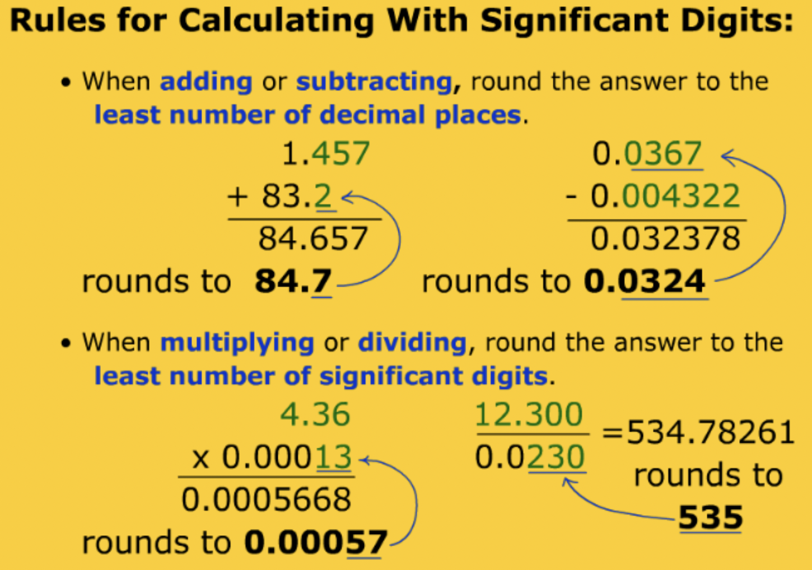

# Significant Figures

### A.K.A: "sig-figs"
--
--
Macy Giffin,
Chemistry, 
Period 3

If you need to follow along go to [Google Slides](https://docs.google.com/presentation/d/1V12Ym88vJxOotDxSzsvSTJ1boQ8RQRiJ3hPEy3Z4xaI/edit#slide=id.p "Sig-Figs").

**Definition**: All the numbers in a measure that represent a certian or uncertain digit.

**Remember**:

- placeholders do not count as significant digits
- non-sigfigs will disappear in scientific notation
- the coefficient is the only thing counted as significant

### We do scientific notation to get rid of the placeholders!

*Remember to always check your toolbox (in the back of your notebook) for important equations and etc.*

