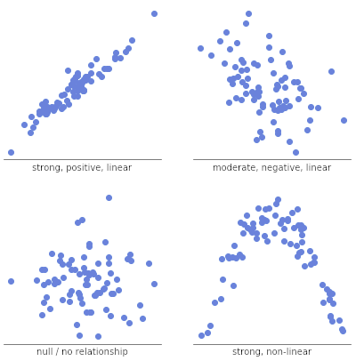

# Comparing Units of Volume

### Milliliters (mL) vs. Cubic Centimeters(cm3)

--- 
---

Macy Giffin, 
Chemistry,
Period 3

If you need to follow along, go to [Google Slides](https://docs.google.com/presentation/d/1c7vPk1eYHkVrp-2UxyqwqO7Wie4FsobWDpehBEnFPt0/edit#slide=id.g15730b73c2d_0_69 "Comparing Units of Volume").

**Volume by Displacement**: a way to measure irregulary using water and a graduated cylinder.

**Important Terms**:

- pattern = relationship
- per = each
- linear = stays the same

### y=mx+b
- m = slope
- x = x-axis
- b = y-intercept

*How do we interpret data and analyze it?*
-- 
### Scatter Plots!

Scatter Plots help us look for a pattern throughout our data.