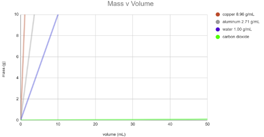
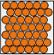
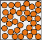
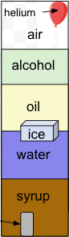

# Density and Phases of Matter

### We did a lab to understand different densities of different matter.
---
---
Macy Giffin, 
Chemistry,
Period 3

If you need to follow along, go to [Google Slides](https://docs.google.com/drawings/d/1GJwM0e6q4uFncBJHPig5mZ1OLdj9GFm8fLt912Iv48Q/edit "Density and Phases of Matter").

**We learned:**

- Different types of particles can carry different amounts of mass. 
- Different arrangements can affect how many particles are in a certain volume.

*The density of most gasses is thousands of times smaller than most liquids and solids.*

**Solid:** 

**Liquid:**

**Gas:**

*Compared to solids and liquids, the particles of a gas are extremely far apart.*

**Density (not weight!) determines if something will sink or float.

- Ojects sink in a fluid that is less dense
- Objects float in a fluid that is more dense

