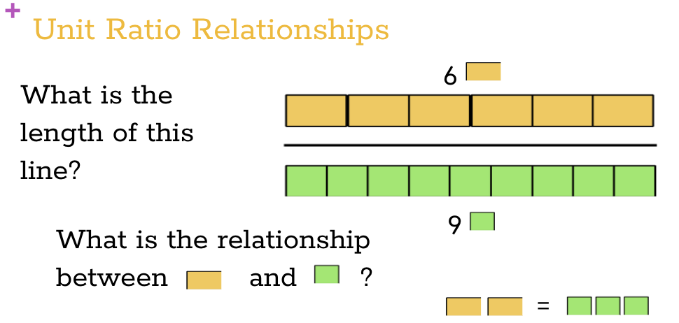
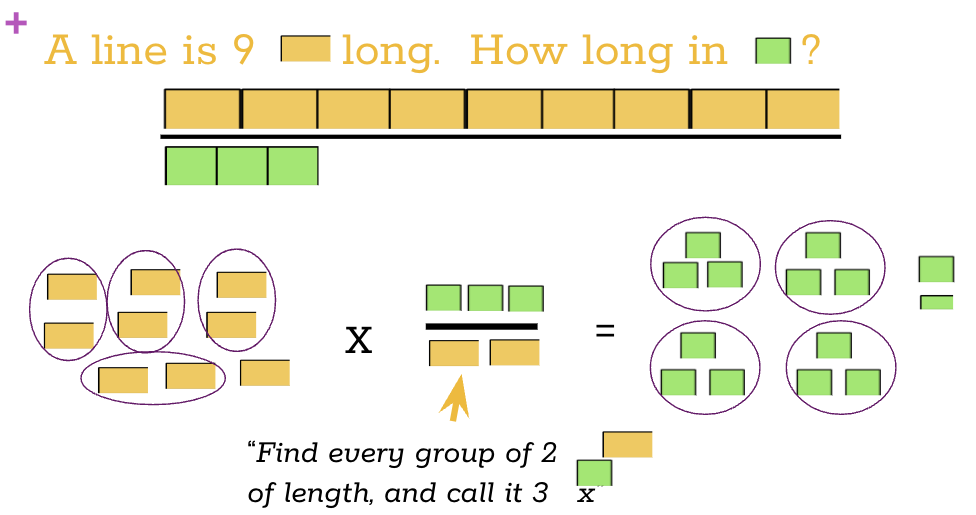
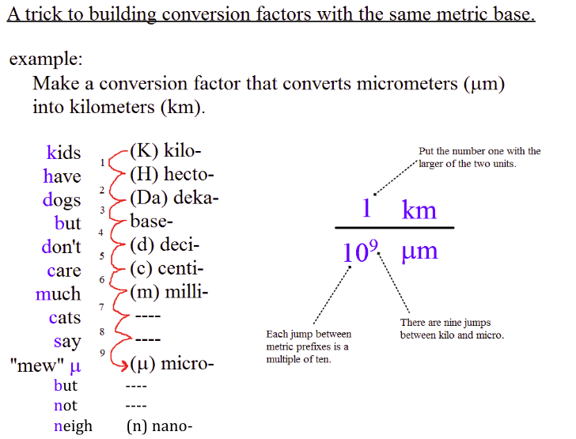

# Dimensional Analysis

### (factor-label method)
---
---
Macy Giffin, 
Chemistry,
Period 3

If you need to follow along, go to [Google Slides](https://docs.google.com/presentation/d/1hu7WIaA960-BsIb9Fnip31IuLXbyKNiBCypBFqRKRcg/edit#slide=id.g282c09772d_0_137 "Density and Phases of Matter").

**This is a technique for solving mathematical problems, but is also used in Chemistry.**

**Important Terms:**
- quantity: communicated by a number and a unit
- unit: an agreed upon size of 1 for a measurement (unit: un=1)
- number: a relationship between the quantity and the unit (Q/U)
- ratio relationship: a ratio between two quantity statements

- conversion factors: multiplying any quantities by one does not change the amount

*Practice:*

**See slideshow for the rest of the practice problems!**

Use this technique to answer future problems in Math and Chemistry.

*Extra Info:*

