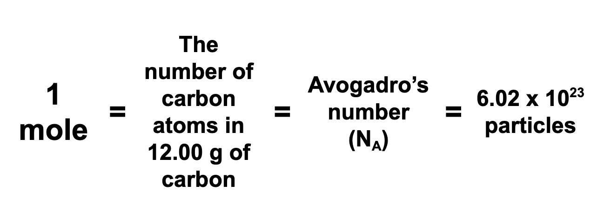
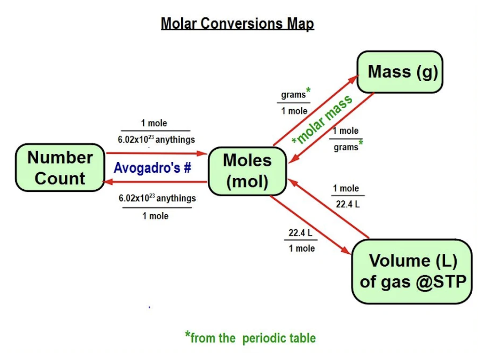

# The Mole Notes

### Mole = "Lump"

##### *The mole provides a bridge that allows us to compare numbers of particles by measuring mass or gaseous volume (see “map” below)*
---
---
Macy Giffin, 
Chemistry,
Period 3

If you need to follow along, go to [Google Docs]("https://docs.google.com/document/d/109GrJ1qwbfNGXRqpOzL-nrvqAGNjTA5iLRnhGR0ZPwM/edit").

*By finding instances in nature where two amounts of different elements have equal numbers of atoms, early chemists were able to find the relative masses of the atoms of each element.*

*Relative masses can be used to compare the number of particles in samples of substances.*

**The atomic mass units on the periodic table are the number of grams per mole (g/mol)! 
This is also called MOLAR MASS.**

*To convert different numbers when solving an equation use this map:*

